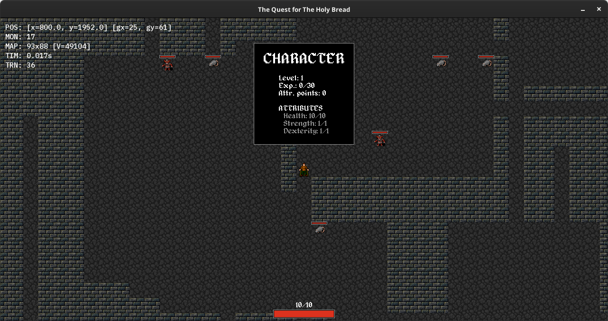

# The Quest for The Holy Bread - GDD

## Info

**Project name:** The Quest for The Holy Bread
**Stack:** C++ + SFML



## Build instructions

**Linux/Unix**

```
$ git clone --recurse-submodules https://github.com/CrossCRS/roguelike
$ cd roguelike
$ ./extern/vcpkg/bootstrap-vcpkg.sh
$ cmake -G Ninja -B build -S . -DCMAKE_TOOLCHAIN_FILE=extern/vcpkg/scripts/buildsystems/vcpkg.cmake -DCMAKE_BUILD_TYPE:STRING=Debug
$ cmake --build build/
```

## Licenses
Fonts:
- [Alagard by Pix3M](https://www.deviantart.com/pix3m/art/Bitmap-font-Alagard-381110713) - CC BY 3.0  
- [Noto Sans Mono](https://fonts.google.com/noto) - Open Font License

Textures: 
- [Dungeon Crawl Stone Soup](http://opengameart.org/content/dungeon-crawl-32x32-tiles-supplemental) - CC0
